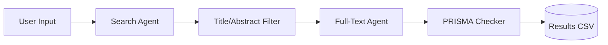

```markdown
# Automated Systematic Literature Review System with PRISMA and Multi-Agent RL

## Project Overview

This system provides an automated pipeline for conducting systematic literature reviews in compliance with PRISMA (Preferred Reporting Items for Systematic Reviews and Meta-Analyses) guidelines. Leveraging Multi-Agent Reinforcement Learning (MARL) with Centralized Training and Decentralized Execution (CTDE), it simulates expert decision-making across all stages of the literature review process.

## Key Features

- **Automated Paper Retrieval**: Live search from arXiv.org with custom topic and date filters
- **Multi-Stage Review Pipeline**: Four specialized agents handle different review phases
- **PRISMA Compliance**: Built-in adherence to systematic review reporting standards
- **Results Export**: CSV output with complete paper metadata and relevance scores

## System Architecture



## Project Structure

```
prisma-marl-review/
├── agents/                   # Reinforcement learning agents
│   ├── search_agent.py       # Paper retrieval agent
│   ├── title_abstract_filter.py  # Initial screening
│   ├── full_text_agent.py    # Content analysis
│   └── prisma_checker.py     # Compliance verification
│
├── env/                      # Custom multi-agent environment
│   └── prisma_env.py         # PettingZoo implementation
│
├── utils/                    # Support modules
│   ├── arxiv_interface.py    # API communication
│   ├── tokenizer.py          # Text processing
│   └── logger.py             # System logging
│
├── configs/                  # Configuration files
│   └── default_config.yaml   # Hyperparameters
│
├── notebooks/                # Example notebooks
│   └── demo_pipeline.ipynb   # Demonstration Jupyter notebook
│
├── main.py                   # Main application entry point
├── requirements.txt          # Dependency specification
└── README.md                 # Project documentation
```

## Installation Guide

### Prerequisites
- Python 3.8 or higher
- pip package manager
- Git version control

### Setup Instructions

1. Clone the repository:
```bash
git clone https://github.com/MOsama10/prisma-marl-review.git
cd prisma-marl-review
```

2. Create and activate a virtual environment:
```bash
python -m venv venv
source venv/bin/activate  # Linux/MacOS
.\venv\Scripts\activate  # Windows
```

3. Install required dependencies:
```bash
pip install -r requirements.txt
```

## Usage Instructions

Execute the main application:
```bash
python main.py
```

The system will prompt for:
1. Research topic (e.g., "reinforcement learning in healthcare")
2. Start year for publication filter
3. End year for publication filter

Output includes:
- Progress logs in terminal
- Final results in `results.csv`
- PRISMA compliance score

## Example Workflow

```plaintext
$ python main.py
Enter research topic: transformer architectures
Start year: 2020
End year: 2023

[INFO] Retrieved 127 papers from arXiv (2020-2023)
[INFO] Title/abstract screening complete: 42 papers remaining
[INFO] Full-text analysis completed: 18 papers meet criteria
[SUCCESS] PRISMA compliance: 89.2% | Results saved to results.csv
```

## Technical Specifications

### Core Dependencies

| Component | Key Packages |
|-----------|--------------|
| Machine Learning | PyTorch 2.0+, Transformers, Sentence-Transformers |
| Reinforcement Learning | PettingZoo, Gymnasium, Ray RLlib |
| Data Processing | pandas, NumPy, pdfminer.six |
| APIs | arxiv, requests |

## Development Roadmap

### Current Features
- [x] arXiv paper retrieval pipeline
- [x] Basic MARL agent implementation
- [x] PRISMA compliance scoring

### Planned Enhancements
- [ ] Integration with PubMed API
- [ ] Human-in-the-loop feedback system
- [ ] Advanced RL training with experience replay
- [ ] Web-based demo deployment

## Contact Information

**Project Maintainer**: Mohamed Osama  
**Email**: M.Osaammaa@gmailcom  
**GitHub**: [https://github.com/MOsama10](https://github.com/MOsama10)  
**Institution**: Nile University 
```

