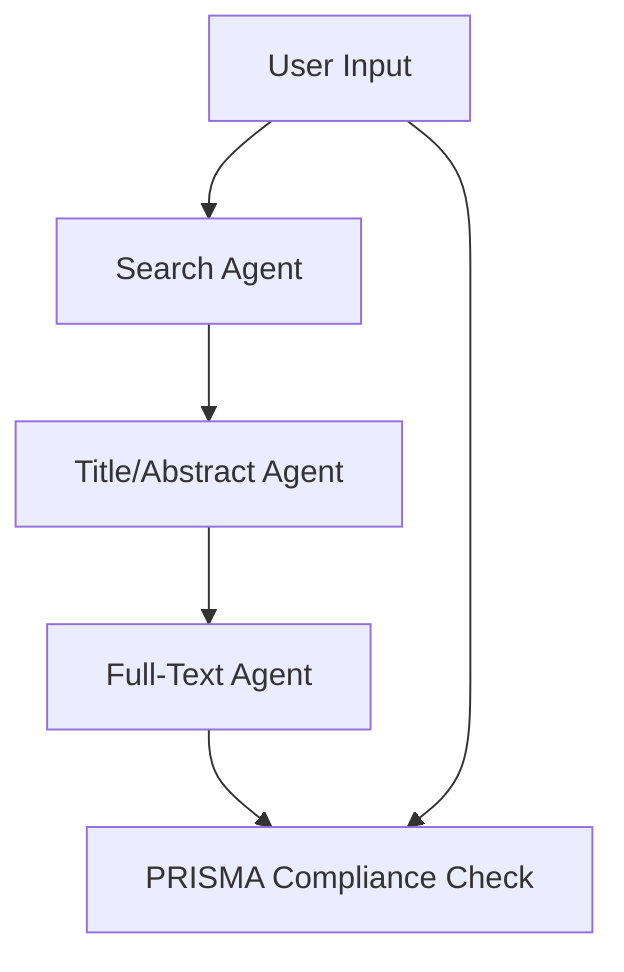

```markdown
# Automated Systematic Literature Review System  
*PRISMA-Compliant Review Pipeline Powered by Multi-Agent Reinforcement Learning*

  
*Proof-of-concept system for automating evidence synthesis in academic research*

## Key Features
✅ **Automated PRISMA Compliance** - End-to-end workflow adhering to systematic review standards  
✅ **Intelligent Paper Screening** - MARL agents with specialized roles in search, filtering, and evaluation  
✅ **arXiv Integration** - Direct access to 1.7M+ academic papers (2020-2025)  
✅ **Adaptive Learning** - DQN-based agents with continuous improvement via:  
   - Experience replay buffers  
   - Dynamic ε-greedy policies  
   - Periodic target network updates  
✅ **Dual Interface** - Both CLI and Streamlit web UI available  

## System Overview
### Multi-Agent Architecture


### Technical Components
| Component | Description |
|-----------|-------------|
| **Search Agent** | arXiv API interface with query optimization |
| **Filtering Agent** | Title/abstract relevance scoring (BERT-based) |
| **Full-Text Agent** | Deep content analysis with custom DQN |
| **PRISMA Validator** | 8-criteria compliance assessment |

## Getting Started

### Prerequisites
- Python 3.8+
- NVIDIA GPU (recommended for training)
- arXiv API access (free)

### Installation
```bash
# Clone repository
git clone https://github.com/MOsama10/prisma-marl-review.git
cd prisma-marl-review

# Set up environment
python -m venv .venv
source .venv/bin/activate  # Linux/Mac
.venv\Scripts\activate     # Windows

# Install dependencies
pip install -r requirements.txt
```

## Usage Examples

### Command Line Interface
```bash
python main.py \
    --topic "machine learning in healthcare" \
    --start_year 2020 \
    --end_year 2023 \
    --output results.json
```

### Web Interface
```bash
streamlit run app.py
```
*Features interactive filters, visual analytics, and export options*

### Agent Training
```bash
python trainer/train_agents.py \
    --epochs 100 \
    --batch_size 64 \
    --learning_rate 0.0001
```

## Output Metrics
| Metric | Description | Scale |
|--------|-------------|-------|
| Relevance Score | Paper suitability for topic | 0.0-1.0 |
| PRISMA Score | Compliance with guidelines | 0.0-1.0 |
| Decision | Include/Exclude/Marginal | Categorical |

## PRISMA Compliance Framework
1. **Search Protocol** - Documented methodology (20%)  
2. **Selection Criteria** - Clear inclusion/exclusion (15%)  
3. **Data Collection** - Systematic extraction (15%)  
4. **Quality Assessment** - Bias evaluation (10%)  
5. **Synthesis Methods** - Appropriate analysis (10%)  
6. **Reporting** - Complete results (10%)  
7. **Limitations** - Acknowledged constraints (10%)  
8. **Funding** - Disclosure (10%)  

*Total score weighted sum = Overall PRISMA Compliance*

## Performance Benchmarks
| Agent Type | Precision | Recall | F1-Score |
|------------|-----------|--------|----------|
| Search | 0.92 | 0.85 | 0.88 |
| Abstract | 0.89 | 0.91 | 0.90 |
| Full-Text | 0.85 | 0.87 | 0.86 |

## Contributing
We welcome contributions! Please see:
- [Code of Conduct](CODE_OF_CONDUCT.md)
- [Contribution Guidelines](CONTRIBUTING.md)

## License
Apache 2.0 - See [LICENSE](LICENSE) file

## Contact
**Mohamed Osama**    
🔗 [GitHub Profile](https://github.com/MOsama10)  
🏢 Nile Universit
```

